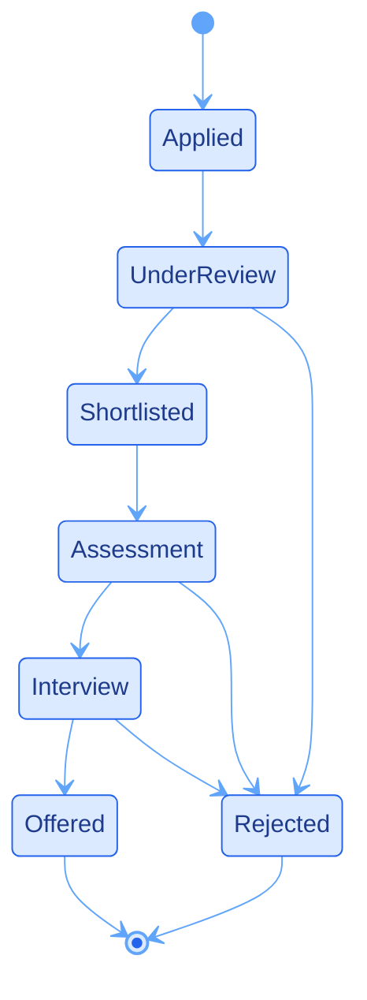

<h1>Live link [https://college-p-lacement-and-student-trac.vercel.app](https://college-p-lacement-and-student-trac-six.vercel.app/login)</h1>

## 🚨 Problem Statement

### College Placement Drive and Student Application Tracker

Placement cells often circulate company notices through WhatsApp messages, emails, notice boards, or informal groups. Student applications may be collected using paper forms, spreadsheets, or separate documents.

As a result, critical placement information becomes scattered:

- Which student applied to which company
- Which students were shortlisted
- Which applications are under review
- Who attended interviews or assessments
- Which students received final offers
- How many students were placed through each drive
- Which drives are still active or pending

This makes it difficult for placement officers to monitor drive performance and for students to track their own application status before deadlines are missed.

---

## 🎯 Project Objective

> Build a centralized placement tracker that records placement drives, student applications, application stages, and final outcomes while providing personalized AI-assisted answers for students.

The system enables:

- 🎓 Students to view placement drives and monitor their own application journey.
- 🧑‍💼 Placement officers to manage companies, drives, and application stages.
- 🛡️ Administrators to maintain users, records, reports, and audit logs.
- 🤖 Students to ask simple placement-related questions in natural language.

---

## 💡 Solution Overview

The **College Placement Drive & Student Application Tracker** is a role-based web application that brings placement activities into one workspace.

Instead of manually searching through multiple Excel files or WhatsApp messages, placement officers can manage all drives and applications from a dashboard. Students can log in, check eligible drives, apply, and track their progress from application to offer.

The system also includes a lightweight AI assistant that answers placement questions using only the currently logged-in student's records.

---

## ✨ Key Features

| Feature | Description |
|---|---|
| 📢 **Placement Drive Notices** | Publish and manage company placement drives in one location |
| 🎓 **Student Applications** | Students can apply for eligible company drives |
| 🔎 **Application Tracking** | Track progress from Applied to Shortlisted, Interviewed, Offered, or Rejected |
| 🧑‍💼 **Officer Dashboard** | Monitor drive participation, applications, and outcomes |
| 🛡️ **Admin Dashboard** | Manage users, placement data, reports, and audit logs |
| 🤖 **AI Placement Assistant** | Answers selected placement questions based on the logged-in student’s data |
| 📊 **Placement Analytics** | Visual reports for applications, drive performance, and placement outcomes |
| 🔐 **Role-Based Access Control** | Separate access for Students, Officers, and Admins |
| 🍪 **Cookie Data Persistence** | Demo data and sessions persist through browser cookies |
| ⚠️ **Empty & Error States** | Handles missing information, unsupported questions, and empty application records |

---

## 👥 User Roles

<div align="center">

| Role | Access | Main Responsibilities |
|:---:|:---|:---|
| 🎓 **Student** | Student Portal | Browse drives, apply, track application progress, use AI assistant |
| 🧑‍💼 **Placement Officer** | Officer Portal | Create drives, manage applications, update student stages, view reports |
| 🛡️ **Admin** | Admin Panel | Full CRUD operations, user management, analytics, and audit monitoring |

</div>

---

## 🗂️ Placement Application Dataset

The project uses a realistic placement application dataset containing approximately **100 application records**.

Each record represents one student application for one company placement drive.

### 📄 Dataset Fields

| Field | Description | Example | Possible Values |
|---|---|---|---|
| `application_id` | Unique identifier for an application record | `APP-001` | Unique alphanumeric ID |
| `student_id` | Unique student identifier | `STU-1042` | Unique student ID |
| `student_name` | Full name of the student | `Riya Sharma` | Text value |
| `company` | Company conducting the placement drive | `TCS` | Company name |
| `drive_date` | Date of the placement drive | `2026-02-18` | Valid date |
| `stage` | Current stage of the application | `Shortlisted` | Applied, Under Review, Shortlisted, Assessment, Interview, Rejected, Offered |
| `offer_status` | Final placement outcome | `Pending` | Pending, Offered, Not Offered |
| `package` | Offered annual salary package | `6.5 LPA` | Numeric value, LPA, `N/A`, or empty |
| `outcome` | Final application result used for reporting/prediction | `Placed` | Placed, Not Placed, Pending |

---

## ⚠️ Deliberate Edge Cases in Dataset

The sample data includes intentionally awkward records to test search, validation, display handling, and assistant behavior.

| Edge Case | Purpose |
|---|---|
| 🕳️ **Missing Package Value** | Ensures the application handles missing salary/package data gracefully |
| 👤 **Similar Student Names** | Tests that student records are identified using IDs and login sessions, not only names |
| ❓ **Unrelated Record** | Tests filtering and prevents irrelevant data from appearing in student results |
| ⏳ **Pending Applications** | Ensures incomplete application outcomes are displayed correctly |
| 🚫 **No Applications** | Tests the empty state for students who have not applied to any drive |

### Example Similar Names

```text
Riya Sharma
Riya S. Sharma
Riya Sharmila
```

> The application uses the logged-in user identity and student ID to prevent data from being mixed between similar names.

---

## 🔄 Application Stage Flow

<div align="center">



</div>

### Application Stages Explained

| Stage | Meaning |
|---|---|
| 📝 **Applied** | Student has submitted an application for the drive |
| ⏳ **Under Review** | Placement officer or company is reviewing the application |
| ✅ **Shortlisted** | Student has been selected for the next round |
| 🧪 **Assessment** | Student must complete an online test, coding round, or aptitude test |
| 💬 **Interview** | Student has progressed to an interview round |
| 🎉 **Offered** | Student has received a placement offer |
| ❌ **Rejected** | Student is no longer progressing in the drive |

---

## 🤖 AI Placement Assistant

The platform includes a simple **rule-based intent-matching assistant**.

It is designed to help students who may not want to search through tables, filters, or menus.

### 🧠 Input Normalization

Before matching a question, the assistant processes the input by:

```text
1. Trimming extra spaces
2. Converting text to lowercase
3. Removing punctuation
4. Matching important placement-related keywords
5. Checking the question against supported intents
```

### Supported Student Questions

| Intent | Example Question | Assistant Response |
|---|---|---|
| 📋 **My Applications** | “Show my applications” | Lists applications submitted by the logged-in student |
| ✅ **Shortlisted Drives** | “Am I shortlisted anywhere?” | Shows drives where the student is shortlisted |
| 🎉 **Offers Received** | “Did I get any offers?” | Displays offer status and package details |
| ⏳ **Pending Applications** | “Which applications are pending?” | Shows drives still under review or in progress |
| 📅 **Upcoming Drives** | “What is my next drive?” | Shows relevant upcoming drive details |
| 📊 **Application Count** | “How many companies did I apply to?” | Returns the total number of applications |

---

## 🔒 Privacy-Scoped Assistant Responses

The assistant only reads information related to the currently authenticated student.

```text
Logged-in Student
      ↓
Student ID from Session
      ↓
Filter Application Records
      ↓
Return Only That Student's Placement Information
```

### Example

If **Riya Sharma** is logged in:

```text
Question:
"Show my shortlisted companies"

Assistant:
"You are shortlisted for Infosys and Wipro."
```

The assistant will not return information belonging to another student.

---

## 🚫 Unsupported Question Handling

If the assistant cannot confidently identify an intent, it does not guess.

Instead, it returns a clear fallback response such as:

```text
Sorry, I could not understand that question.

You can ask things like:
• Show my applications
• Am I shortlisted anywhere?
• Did I receive any offers?
• Which applications are pending?
• How many companies did I apply to?
```

> This prevents incorrect answers about placement status, salary packages, or student eligibility.

---

## 📊 Derived Figures & Calculations

The dashboard calculates useful placement metrics from the stored application dataset.

### Total Applications

```text
Total Applications = Count of all application records
```

### Total Offers

```text
Total Offers = Count of records where offer_status = "Offered"
```

### Placed Students

```text
Placed Students = Count of unique students with outcome = "Placed"
```

### Placement Rate

```text
Placement Rate (%) =
(Number of Placed Students ÷ Total Eligible Students) × 100
```

### Shortlisted Applications

```text
Shortlisted Applications =
Count of records where stage = "Shortlisted"
```

### Drive Participation

```text
Drive Participation =
Number of applications submitted for a particular company drive
```

---

## 🧮 Example Calculation

Assume the system contains:

```text
Total Students: 100
Students Placed: 58
```

The placement rate is calculated as:

```text
Placement Rate = (58 ÷ 100) × 100
Placement Rate = 58%
```

If a company drive has:

```text
Applications Received: 24
Students Shortlisted: 10
Offers Released: 4
```

The dashboard can display:

```text
Shortlisting Rate = (10 ÷ 24) × 100 = 41.67%
Offer Conversion Rate = (4 ÷ 24) × 100 = 16.67%
```

---

## 🧪 Testing Checklist

The application was tested across the major placement workflow.

| Test Case | Expected Result |
|---|---|
| Student logs in successfully | Student dashboard loads with personal records |
| Student views available drives | Relevant placement drives are displayed |
| Student applies for a drive | New application is added to their profile |
| Officer creates a drive | Drive becomes available in the placement workspace |
| Officer updates application stage | Student dashboard reflects the updated stage |
| Admin manages users | User records can be viewed and modified |
| Student asks supported AI question | Assistant returns personal placement information |
| Two students ask same question | Each student receives only their own results |
| Student asks unsupported question | Assistant shows a safe fallback response |
| Missing package value exists | UI displays `N/A` or appropriate fallback state |
| Student has no applications | Empty state message is shown |
| Browser page reloads | Cookie-based data remains available |

---

## ✅ Manual Verification Example

One calculated figure was manually checked against the stored dataset.

```text
Company: TCS
Total Applications in Dataset: 12
Shortlisted Students: 5
Offers Given: 2
```

Expected dashboard values:

```text
Applications: 12
Shortlisted: 5
Offers: 2
```

The dashboard values were compared manually with the source data to confirm correctness.

---

## 🔐 Authentication & Security

### Current Demo Architecture

The deployed frontend version uses browser cookies for session persistence and demo data storage.

| Security Feature | Purpose |
|---|---|
| 🍪 **Session Cookie** | Stores the active user session |
| 👥 **RBAC** | Controls access based on Student, Officer, or Admin role |
| 🔎 **Student Data Filtering** | Prevents assistant responses from exposing other students’ records |
| ⚠️ **Generic Login Errors** | Avoids exposing whether a specific account exists |
| ✅ **Input Validation** | Validates required form fields and placement data |
| 🧾 **Audit Logs** | Tracks important admin actions within the application |

### Production Security Note

> For a real production deployment, authentication should be handled on a secure backend using salted password hashes such as **bcrypt** or **argon2**, HTTP-only cookies, server-side validation, and a persistent database.

The included optional legacy backend can be used as a foundation for backend-based authentication and database storage.

---

## 🍪 Browser Cookie Storage

The current Vercel-ready implementation stores demo data inside browser cookies.

| Cookie Key | Stored Information |
|---|---|
| `pt_session` | Active logged-in user session |
| `pt_data_*` | Chunked JSON data for users, companies, drives, applications, and logs |

### Benefits

- ✅ No production database required
- ✅ No backend server required for demo deployment
- ✅ Works directly on Vercel
- ✅ Data persists after browser refresh
- ✅ Simple setup for assessment demonstration

### Limitation

Cookie-based storage is suitable for a **demo, prototype, or academic assessment**. A real college deployment should use a secure backend and database.

---
## 📁 Suggested Project Structure

```text
placement-tracker/
│
├── frontend/
│   ├── src/
│   │   ├── components/
│   │   ├── pages/
│   │   ├── hooks/
│   │   ├── lib/
│   │   ├── data/
│   │   └── types/
│   ├── public/
│   ├── vercel.json
│   └── package.json
│
├── backend/                  # Optional legacy backend
│   ├── prisma/
│   ├── src/
│   ├── .env.example
│   └── package.json
│
├── screenshots/
│   ├── login.png
│   ├── student-dashboard.png
│   ├── officer-dashboard.png
│   ├── admin-dashboard.png
│   └── assistant.png
│
├── presentation.pdf
├── README.md
└── LICENSE
```

---

## 📦 Deliverables

The repository contains or should contain the following SIH assessment deliverables:

| Deliverable | Description |
|---|---|
| 💻 **Source Code** | Complete frontend and optional backend source code |
| 📄 **README.md** | Setup guide, dataset explanation, calculations, and features |
| 📊 **presentation.pdf** | 6–8 slide project presentation |
| 🖼️ **Screenshots** | Screenshots from the working application |
| 🎥 **Demo Video** | Short working demonstration of the system |
| 📁 **Dataset** | Sample placement application records |
| 🌐 **GitHub Repository** | Public repository containing all project files |

---

## 🎞️ Presentation Content

The project presentation should include the following points:

1. **The Problem**  
   Manual placement tracking causes missed deadlines and scattered records.

2. **Who Is Affected**  
   Students, placement officers, administrators, and companies.

3. **The Solution**  
   A centralized platform for managing drives, applications, and placement outcomes.

4. **Working Screenshots**  
   Login, dashboards, drive management, applications, and AI assistant.

5. **Derived Metrics**  
   Explain placement rate, offer count, shortlisting rate, and drive participation.

6. **What Works**  
   Role-based portals, drive management, tracking, reporting, and AI queries.

7. **What Is Unfinished**  
   Production database integration, real notifications, and advanced AI capabilities.

8. **Future Improvement**  
   Resume parsing, WhatsApp alerts, cloud synchronization, and LLM-based recommendations.

---

## 🔮 Future Enhancements

| Enhancement | Description |
|---|---|
| 📄 **Resume Parsing** | Automatically extract CGPA, skills, projects, and certifications |
| 🧠 **AI Drive Recommendations** | Suggest suitable drives based on skills, branch, and CGPA |
| 📧 **Email Notifications** | Notify students about new drives and application updates |
| 💬 **WhatsApp Integration** | Send deadlines, interview updates, and offer notifications |
| 📱 **Mobile Application** | Develop a React Native mobile app |
| ☁️ **Cloud Database** | Integrate Supabase, Firebase, PostgreSQL, or PlanetScale |
| 🔐 **Production Authentication** | Add bcrypt/argon2 password hashing and secure server sessions |
| 📈 **Advanced Analytics** | Department-wise placement rate, company trends, and salary insights |
| 📎 **Document Uploads** | Upload resumes, offer letters, and placement documents |

---

## 🛠️ Local Development

### Prerequisites

```text
Node.js 18+
npm
```

### Run the Frontend

```bash
# Navigate to frontend directory
cd frontend

# Install dependencies
npm install

# Start the Vite development server
npm run dev
```

Open:

```text
http://localhost:5173
```

---

## ▲ Deploy on Vercel

1. Push the project to GitHub.
2. Open [Vercel](https://vercel.com).
3. Import the GitHub repository.
4. Set the root directory:

```text
placement-tracker/frontend
```

5. Click **Deploy**.

The application can run as a static React SPA without requiring a production backend.

---

## 🔑 Demo Credentials

| Role | Email | Password |
|---|---|---|
| 🛡️ Admin | `admin@college.edu` | `Admin@1234` |
| 🧑‍💼 Placement Officer | `officer@college.edu` | `Officer@1234` |
| 🎓 Student | `riya.sharma@college.edu` | `Student@1234` |

---

## 🧹 Reset Demo Data

To reset the placement data and login session:

```text
Browser DevTools
      ↓
Application
      ↓
Cookies
      ↓
Clear Cookies for This Website
      ↓
Refresh the Application
```

This restores the application to its default demo state.

---

## 📜 License

This project is licensed under the **MIT License**.

See the [LICENSE](LICENSE) file for more information.

---

## 👨‍💻 Author

<div align="center">

### MATTHEW P R

**Register Number:** 411623149030  
**Institution:** PDKVCET  
**Department:** CYBER  
**Year:** IV  
**Assessment:** SIH 2026 — Internal Practical Assessment  

</div>

---

<p align="center">
  
  
  
</p>

<p align="center">
  <b>Made with dedication for SIH 2026 Internal Practical Assessment 🚀</b>
</p>

<p align="center">
  
</p>
```
