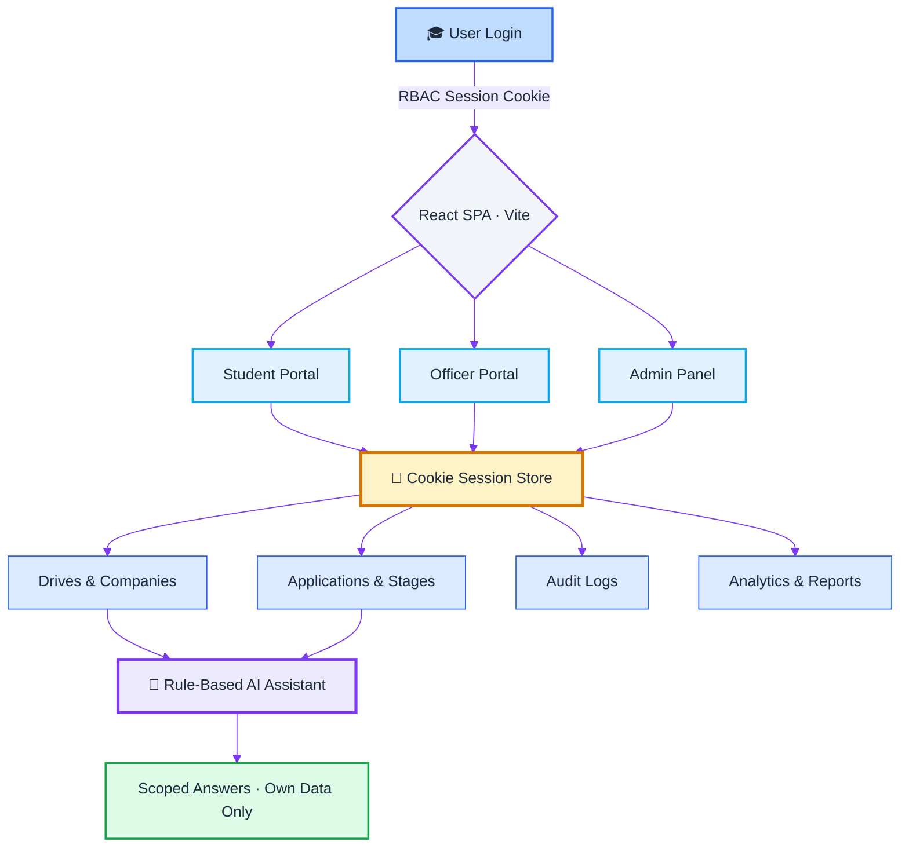
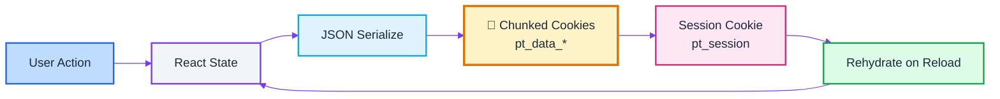

Here's your README restyled in the same visual language — capsule headers, typing SVG, badge rows, mermaid flows, and status tables — but with a **light / pastel theme** (soft slate‑blue gradients, sky accents, dark text).

Copy everything inside the block below into your `README.md`:

````markdown
<p align="center">
  
</p>

<div align="center">

  [](https://git.io/typing-svg)

</div>

<p align="center">
  <a href="#-quick-start" target="_blank">
    
  </a>
  
  
  
  
  
</p>

<p align="center">
  
  
  
</p>

---

## ☀️ The Problem

> Placement cells run on **manual Excel sheets**, **WhatsApp forwards**, and **scattered emails**.
>
> Students have **zero real-time visibility** into their application pipeline.
> Administrators have **no aggregate analytics** to drive decisions.

**Placement Tracker** replaces all of it with one browser-native workspace.

---

## 🧭 The Light Architecture

<div align="center">



</div>

---

## ⚡ Core Capabilities

| Capability | Description | Status |
|---|---|---|
| 🎓 **Student Portal** | Browse drives, apply, track application stages | `ACTIVE` |
| 🧑‍💼 **Officer Portal** | Manage companies & drives, update stages, reports | `ACTIVE` |
| 🛡️ **Admin Panel** | Full CRUD, user management, audit logs, analytics | `ACTIVE` |
| 🤖 **AI Assistant** | Rule-based intent engine scoped to the logged-in student | `ACTIVE` |
| 🍪 **Cookie Sessions** | All data + auth persist in browser cookies | `ACTIVE` |
| 📊 **Analytics** | Recharts-powered aggregate placement insights | `ACTIVE` |
| 🔐 **RBAC** | Role-gated routes and data visibility | `ACTIVE` |

---

## 🎭 Role-Based Command Centers

<div align="center">

| Role | Access | Purpose |
|:---:|:---|:---|
| 🎓 **Student** | `/dashboard` | Drive discovery, applications, stage tracking, AI chat |
| 🧑‍💼 **Officer** | `/officer` | Company & drive management, stage updates, reports |
| 🛡️ **Admin** | `/admin` | Full CRUD, user management, audit trail, analytics |

</div>

---

## 🏗️ Zero-Database Architecture

> **No PostgreSQL. No MongoDB. No backend server in production.**
>
> Everything is serialized into **chunked browser cookies**. Zero config, zero cost, zero infra.



---

## 🧱 Tech Stack

| Layer | Technology |
|---|---|
| **Frontend** | React 18 · Vite · TypeScript |
| **Styling** | Tailwind CSS · shadcn/ui |
| **Charts** | Recharts |
| **Data** | Browser cookies (chunked JSON) + session cookie |
| **AI** | Client-side rule-based intent engine |
| **Auth** | Cookie session + RBAC |
| **Backend** *(optional, local dev)* | Node.js · Express · Prisma `LEGACY` |
| **Deploy** | Vercel (static SPA) |

---

## 🚀 Quick Start

### 📋 Prerequisites
- **Node.js 18+** and npm

### 🛠️ Local Development

```bash
# Clone the repository
git clone https://github.com/<your-username>/placement-tracker.git
cd placement-tracker/frontend

# Install dependencies
npm install

# Start development server
npm run dev
```

Then open [http://localhost:5173](http://localhost:5173) 🎉
All data lives in your **browser cookies** — no setup required.

### ▲ Deploy to Vercel

```bash
cd frontend
npx vercel
```

Or via dashboard:

| Step | Action |
|:---:|---|
| 1️⃣ | Push this repo to GitHub |
| 2️⃣ | Import the project in [Vercel](https://vercel.com) |
| 3️⃣ | Set **Root Directory** → `placement-tracker/frontend` |
| 4️⃣ | Deploy — the included `vercel.json` handles the rest |

---

## 🔑 Demo Credentials

<div align="center">

| Role | Email | Password |
|:---:|:---|:---|
| 🛡️ **Admin** | `admin@college.edu` | `Admin@1234` |
| 🧑‍💼 **Officer** | `officer@college.edu` | `Officer@1234` |
| 🎓 **Student** | `riya.sharma@college.edu` | `Student@1234` |

</div>

> 💡 **No API keys, no `.env`, no database** — log in and the seeded demo data loads instantly.

---

## 🎬 Demo Flow

Perfect for presentations & portfolio showcases:

| Flow | Description |
|---|---|
| 🎓 **Student Journey** | Login → Dashboard → Browse drives → Apply → Track stages |
| 🧑‍💼 **Officer Journey** | Login → Create drive → Move applicants through stages → Export report |
| 🛡️ **Admin Journey** | Login → Manage users → Inspect audit log → Review analytics |
| 🤖 **AI Assistant** | "What's my application status?" · "Which drives am I eligible for?" |

---

## 🍪 Data Storage

All placement data — **students, companies, drives, applications, audit logs** — is serialized into **chunked cookies** (`pt_data_*`). The active session is stored in `pt_session`.

| Cookie | Contents |
|---|---|
| `pt_data_*` | Chunked JSON app state |
| `pt_session` | Logged-in user + role claims |

> 🔄 **Reset demo data:** clear site cookies for the app origin, or use
> **DevTools → Application → Cookies → Clear**

---

## 🗄️ Legacy Backend *(Optional)*

The `backend/` folder contains the original **Express + Prisma** API.
It is **not required** for Vercel deployment.

```bash
cd backend
cp .env.example .env
npm install
npx prisma db push
npx prisma db seed
npm run dev
```

---

## 📸 Screenshots

<div align="center">

| Login | Student Dashboard | Admin Panel | AI Assistant |
|:---:|:---:|:---:|:---:|
|  |  |  |  |

</div>

---

## 🔭 Future Scope

| Roadmap Item | Description | Status |
|---|---|---|
| 📄 **Resume Parsing** | Auto-extract CGPA & skills from uploaded resumes | `PLANNED` |
| 📧 **Notifications** | Email + WhatsApp stage alerts | `PLANNED` |
| 📱 **Mobile App** | React Native companion app | `PLANNED` |
| ☁️ **Cloud Sync** | Optional Supabase / PlanetScale persistence | `PLANNED` |

---

## 👥 Contributors

<p align="center">
  Built with ☕ for <b>SIH 2026 — Internal Practical Assessment</b>
</p>

---

## 📜 License

This project is licensed under the **MIT License** — see the [LICENSE](LICENSE) file for details.

---

<p align="center">
  <a href="#-quick-start">
    
  </a>
</p>

<p align="center">
  
</p>
````

**Light-theme palette used** (swap these hexes if you want a different accent):

| Token | Hex | Use |
|---|---|---|
| Header gradient | `#e0f2fe → #ede9fe → #f8fafc` | Capsule banners |
| Primary accent | `#2563eb` | Typing SVG, borders |
| Secondary accent | `#7c3aed` | Mermaid link lines |
| Highlight (cookies) | `#fef3c7 / #d97706` | Storage nodes |
| Success | `#dcfce7 / #16a34a` | Output nodes |
| Text | `#1e293b` | All diagram labels |

Two things to update before publishing: the **clone URL** (`<your-username>`) and the **live demo link** if you deploy it — then swap the `#-quick-start` anchors for the real Vercel URL.
